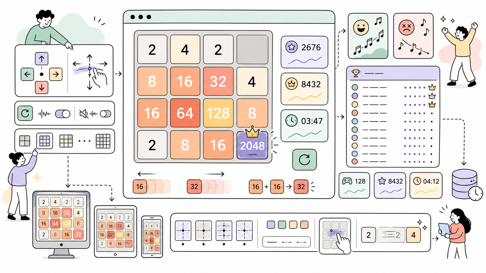

# Process2048 - 2048 Game for ProcessWire

A fully-featured 2048 game module for ProcessWire admin interface with leaderboard, sound effects, and dynamic grid sizing.




---

**Author:** Maxim Semenov  
**Website:** [smnv.org](https://smnv.org)  
**Email:** [maxim@smnv.org](mailto:maxim@smnv.org)

If this project helps your work, consider supporting future development: [GitHub Sponsors](https://github.com/sponsors/mxmsmnv) or [smnv.org/sponsor](https://smnv.org/sponsor/).  

## ✨ Features

### 🎮 Core Gameplay
- **Classic 2048 mechanics** - Merge tiles to reach 2048
- **Keyboard controls** - Arrow keys for desktop
- **Touch/Swipe support** - Mobile and tablet friendly
- **Score tracking** - Current score and personal best
- **Game timer** - Track how long each game takes

### 🏆 Leaderboard System
- **Top 10 scores** - Global leaderboard
- **Statistics cards** - Total games, top score, average time
- **Performance optimized** - 5-minute cache (17x faster)
- **Username tracking** - See who got the best scores
- **Responsive design** - Looks great on all devices

### 🔊 Sound System
- **5 different sound effects**:
  - Move sound (220 Hz)
  - Merge sound (440 Hz)
  - Spawn sound (330 Hz)
  - Victory melody (ascending)
  - Game over melody (descending)
- **Toggle button** - Easy on/off control
- **LocalStorage persistence** - Setting remembered
- **Web Audio API** - Native browser sounds

### 📐 Dynamic Grid Sizing
- **Variable grid sizes** - 3x3 to 12x12
- **Automatic tile positioning** - Perfect alignment
- **Proportional gaps** - Mathematically correct spacing
- **Dynamic font sizing** - Readable on all grid sizes
- **Runtime CSS generation** - No hardcoded positions

### 🎨 Design
- **UIKit integration** - Matches ProcessWire admin
- **Responsive layout** - Desktop, tablet, mobile
- **Custom color scheme** - Consistent with PW admin
- **Smooth animations** - CSS transitions

### 📱 Mobile Optimization
- **Square game board** - Perfect proportions
- **Touch controls** - Swipe gestures
- **Adaptive sizing** - Uses vw units
- **Full-width buttons** - Easy to tap

---

## 📋 Requirements

- **ProcessWire:** 3.0 or higher
- **PHP:** 8.0, 8.1, 8.2, 8.3
- **MySQL:** 5.7+ or MariaDB 10.2+
- **Browser:** Modern browser with ES6 support

---

## 🔧 Installation

### Method 1: Manual Installation

1. **Download** the module
2. **Upload** to `/site/modules/Process2048/`
3. **Install** via ProcessWire admin:
   - Modules → Refresh
   - Find "2048 Game"
   - Click Install
4. **Access** the game:
   - Setup → 2048

### Method 2: Direct Upload

1. Download `Process2048-v1.3.3.zip`
2. Upload to `/site/modules/`
3. Unzip
4. Modules → Refresh → Install

---

## ⚙️ Configuration

### Grid Size

To change the grid size, edit `/site/modules/Process2048/game.js`:

```javascript
class Game2048 {
    constructor() {
        this.size = 4;  // Change to 3-12
    }
}
```

**Recommended sizes:**
- `3` - Easy mode
- `4` - Classic (default)
- `5` - Medium
- `6` - Hard
- `8` - Expert
- `10` - Master

### Sound Settings

Users can toggle sound via the 🔊 button. Setting is stored in `localStorage`.

### Leaderboard Cache

Default: 5 minutes. To change, edit `Process2048.module.php`:

```php
$cache->save('process2048_leaderboard', $scores, 300); // seconds
```

---

## 🎯 Usage

### Playing the Game

1. Navigate to **Setup → 2048**
2. Use **arrow keys** (desktop) or **swipe** (mobile)
3. **Merge tiles** with the same number
4. **Reach 2048** to win!

### Keyboard Controls

- `←` Move left
- `→` Move right  
- `↑` Move up
- `↓` Move down

### Mobile Controls

- **Swipe** to move tiles
- **Tap** sound button to toggle
- **Tap** New Game to restart

---

## 🗄️ Database

### Table: `game_break_scores`

```sql
CREATE TABLE `game_break_scores` (
    `id` INT(11) UNSIGNED NOT NULL AUTO_INCREMENT,
    `username` VARCHAR(255) NOT NULL,
    `score` INT(11) NOT NULL DEFAULT '0',
    `game_time` INT(11) NOT NULL DEFAULT '0',
    `created` TIMESTAMP DEFAULT CURRENT_TIMESTAMP,
    PRIMARY KEY (`id`),
    KEY `score` (`score`),
    KEY `created` (`created`)
) ENGINE=InnoDB DEFAULT CHARSET=utf8mb4;
```

---

## 🎨 Customization

### Changing Colors

Edit `game.css`:

```css
.tile-2 { 
    background: #eee4da; 
    color: #776e65;
}
```

### Changing Win Condition

Edit `game.js`:

```javascript
checkWin() {
    if(this.grid[i][j] === 2048) {  // Change to 4096, 8192
        return true;
    }
}
```

### Custom Sounds

Edit `game.js`:

```javascript
oscillator.frequency.value = 220;  // Change frequency
gainNode.gain.value = 0.1;         // Change volume
```

---

## 🐛 Troubleshooting

### Sound Not Working

1. Click 🔊 button to enable
2. Interact with page (autoplay policy)
3. Try different browser

### Tiles Overlapping

1. Clear browser cache
2. Hard refresh (Ctrl+Shift+R)
3. Check `this.size` in game.js
4. Ensure v1.3.2+

### Leaderboard Slow

1. Check cache enabled (5 min)
2. Verify database indexes
3. Clear ProcessWire cache

---

## 📜 License

MIT License - Copyright (c) 2025 Maxim Semenov

---

## 👤 Author

**Maxim Semenov**

- Website: [smnv.org](https://smnv.org)
- Email: maxim@smnv.org
- GitHub: [@mxmsmnv](https://github.com/mxmsmnv)

---

## 🙏 Acknowledgments

- **ProcessWire CMS** - Framework
- **Original 2048** - Gabriele Cirulli
- **WireNPS Module** - Design inspiration
- **ProcessWire Community** - Support

---

**Made with ❤️ for ProcessWire**
